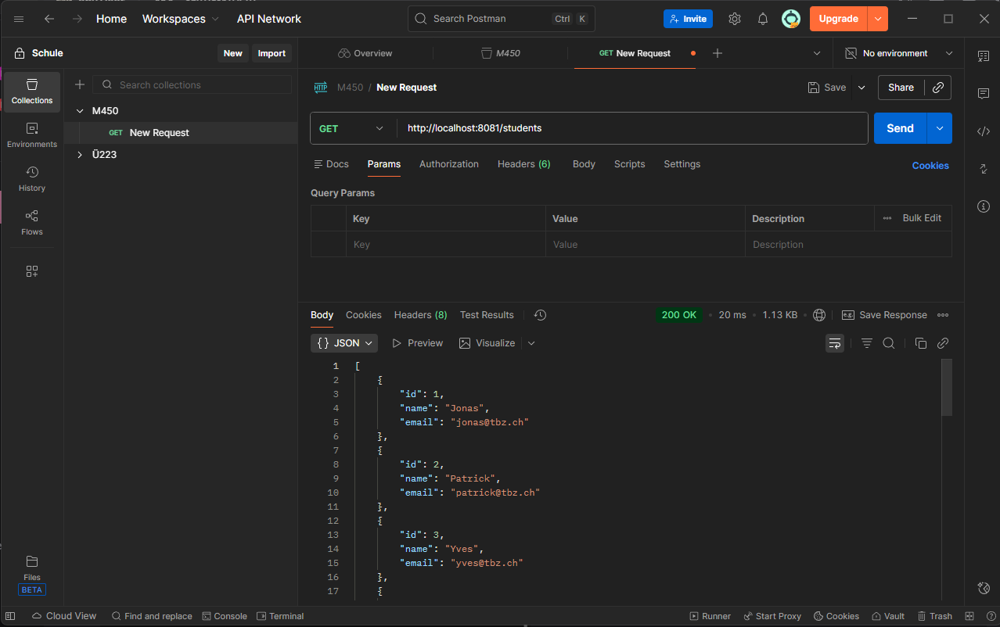

# Übung 1 - Automatisiertes Backend Testing

## Lösung: Node.js mit Playwright

### Tool-Wahl

**Playwright** für automatisierte REST API Tests

### Vorteile

-   Native HTTP-Request Unterstützung über `APIRequestContext`
-   Einfache Assertion-Bibliothek
-   Gut strukturierte Test-Reports
-   TypeScript Support

### Installation

```bash
npm init playwright@latest
```

### Beispiel Test

```javascript
import { test, expect } from "@playwright/test";

test("GET /api/users sollte 200 zurückgeben", async ({ request }) => {
	const response = await request.get("http://localhost:3000/api/users");
	expect(response.status()).toBe(200);
	const data = await response.json();
	expect(data).toHaveProperty("users");
});

test("POST /api/users sollte User erstellen", async ({ request }) => {
	const response = await request.post("http://localhost:3000/api/users", {
		data: {
			name: "Max Mustermann",
			email: "max@example.com",
		},
	});
	expect(response.status()).toBe(201);
});
```

### Tests ausführen

```bash
npx playwright test
```

### Ergebnis

✅ Vollautomatisierte REST API Tests  
✅ Einfache Integration in CI/CD  
✅ Übersichtliche Test-Reports

# Übung 2

# Übung 3


